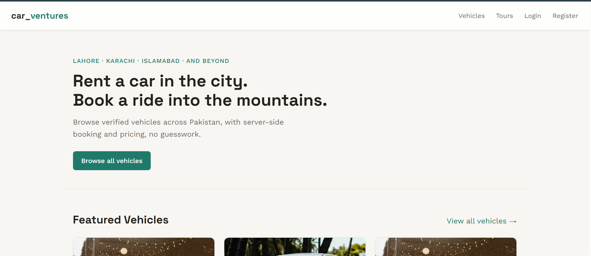
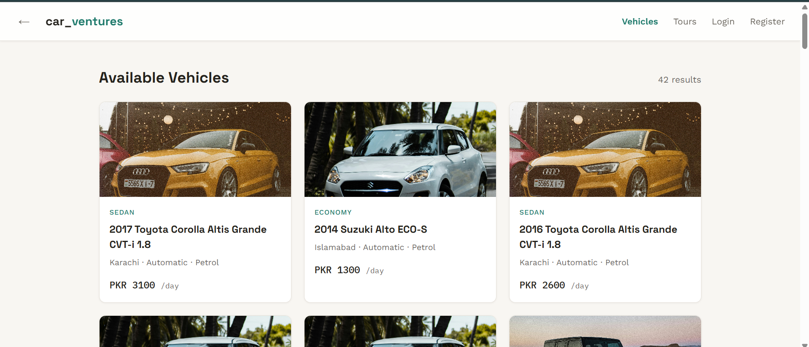
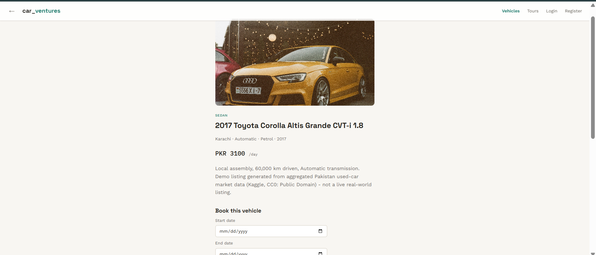
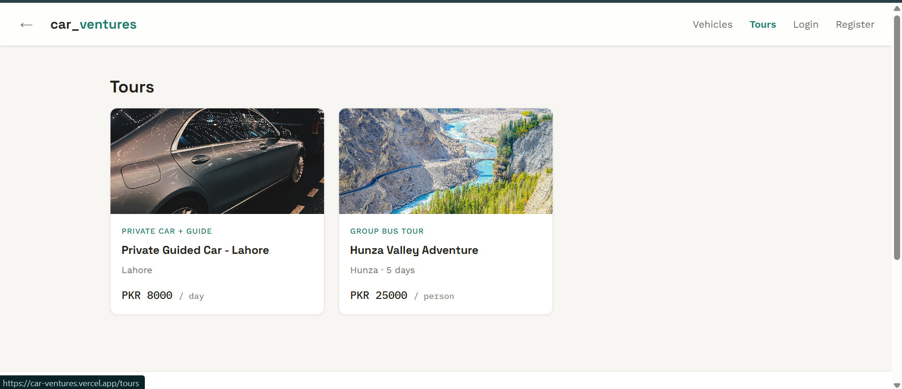
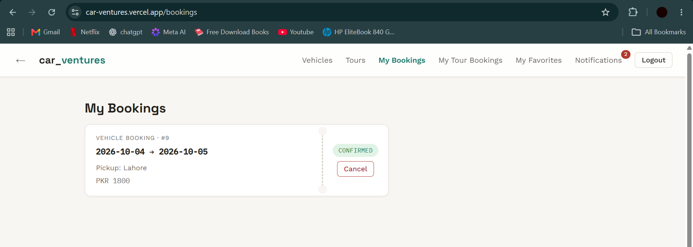
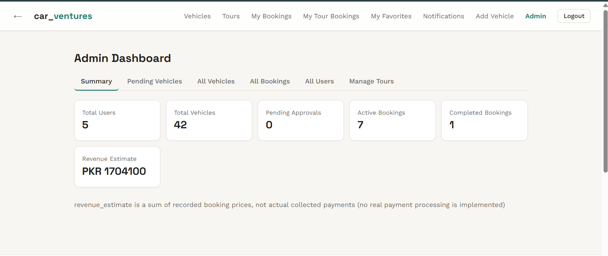
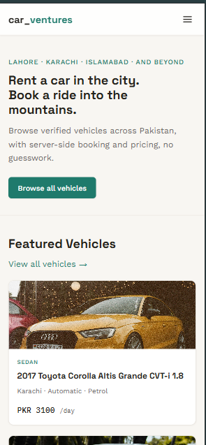

# car_ventures 🚗

**AI-Assisted Vehicle Platform** — a full-stack vehicle rental, marketplace, and tourism platform for Pakistan, built as a portfolio project to demonstrate production-style engineering: REST API design, relational data modeling, auth, testing, and deployment.


**🔗 Live Demo:** [car-ventures.vercel.app](https://car-ventures.vercel.app)

> ⚠️ This is a demo/portfolio project, not a live business. Payments and AI price estimates are simulated and clearly labeled as such throughout the app. The backend runs on Render's free tier, which spins down after ~15 minutes of inactivity — the first request after a period of inactivity can take 30–60 seconds while it wakes back up.

---

## Overview

car_ventures covers the full journey of a vehicle rental and tours marketplace — browsing, booking, favorites, reviews, notifications — plus a real admin dashboard for moderating listings and managing bookings. Pakistan-first (PKR pricing, Pakistani cities, +92 phone codes) but built on an architecture that stays internationally extensible.

An AI price-estimation feature is already live: a scikit-learn model trained on a cleaned Pakistani used-car dataset suggests a rental price based on a vehicle's specs.

## Features

**Customer-facing**
- JWT-based authentication (register, login, persistent session)
- Vehicle browsing with category, transmission, fuel-type, and location detail
- Server-side booking with real date-overlap prevention — a vehicle can never be double-booked
- Tours: seat-based group bus trips (per-departure-date capacity limits) and private car-with-guide bookings (date-range overlap prevention)
- Favorites, reviews with star ratings, and in-app notifications
- AI-estimated rental pricing based on vehicle specs (clearly labeled as an estimate)
- Fully responsive — tablet and mobile get a collapsible nav menu, stacked ticket layout, and horizontally-scrolling admin tables

**Admin**
- Role-based access control (user / admin), auto-assigned via a configured admin email on registration
- Vehicle moderation queue (approve / reject / suspend)
- Booking and tour-booking status management
- Safe deletion — vehicles/tours with existing bookings return a 409 instead of deleting, protecting booking history
- Platform-wide summary stats (users, vehicles, bookings, revenue estimate)

**Engineering**
- Full CRUD REST API with FastAPI + SQLAlchemy 2.0, 100% Alembic-migration-driven schema (no `create_all()`)
- Pydantic enum validation at every status-transition API boundary (bookings, tour bookings, vehicle moderation)
- 75 backend tests (pytest, in-memory SQLite) + 21 frontend tests (Vitest, React Testing Library)
- Skeleton loading states throughout (no layout-shifting spinners)
- Deployed on free-tier infrastructure end-to-end (Render + Vercel + Neon Postgres)

## Tech Stack

| Layer | Technology |
|---|---|
| Frontend | React 19, Vite, React Router v7, Axios — hand-rolled CSS design system, no UI framework |
| Backend | FastAPI, SQLAlchemy 2.0, Pydantic v2 |
| Auth | JWT (python-jose), bcrypt password hashing |
| Database | PostgreSQL (Neon) |
| Migrations | Alembic |
| ML | scikit-learn, pandas, joblib |
| Backend tests | pytest, httpx (75 tests) |
| Frontend tests | Vitest, React Testing Library (21 tests) |
| Deployment | Vercel (frontend) · Render (backend) · Neon (database) |

## Screenshots

_Drop your image files into `docs/screenshots/` with these exact names and they'll render below:_

| Home | Vehicles |
|---|---|
|  |  |

| Vehicle Detail | Tours |
|---|---|
|  |  |

| My Bookings | Admin Dashboard |
|---|---|
|  |  |

| Mobile Navigation |
|---|
|  |

## Getting Started

### Prerequisites
- Python 3.11+ (developed against 3.13)
- Node.js 18+
- A PostgreSQL connection string (this project uses [Neon](https://neon.tech)'s free tier)

### Backend Setup

```bash
cd backend
python -m venv venv
venv\Scripts\activate          # Windows
pip install -r requirements.txt
```

Create `backend/.env` (see `.env.example` for the required variables), then:

```bash
alembic upgrade head
uvicorn app.main:app --reload
```

Backend runs at `http://localhost:8000` — interactive API docs at `http://localhost:8000/docs`.

### Frontend Setup

```bash
cd frontend
npm install
```

Create `frontend/.env` (see `.env.example`), then:

```bash
npm run dev
```

Frontend runs at `http://localhost:5173`.

### Environment Variables

**Backend (`backend/.env`)**

| Variable | Description |
|---|---|
| `DATABASE_URL` | PostgreSQL connection string |
| `CORS_ORIGINS` | Comma-separated list of allowed frontend origins |
| `JWT_SECRET` | JWT signing secret |
| `ADMIN_EMAIL` | Email address that gets `admin` role automatically on registration |

**Frontend (`frontend/.env`)**

| Variable | Description |
|---|---|
| `VITE_API_BASE_URL` | Base URL of the backend API |

## Running the Tests

```bash
# Backend — 75 tests
cd backend
venv\Scripts\activate
pytest tests/ -q

# Frontend — 21 tests
cd frontend
npm test
```

## Project Structure

```
car_ventures/
├── backend/
│   ├── app/
│   │   ├── routers/        # auth, vehicles, bookings, tours, tour_bookings,
│   │   │                   # favorites, reviews, notifications, admin, ai
│   │   ├── models/         # SQLAlchemy models
│   │   ├── schemas/        # Pydantic request/response schemas
│   │   ├── ml/             # the trained model the API loads at runtime
│   │   └── main.py
│   ├── alembic/            # migrations (schema is 100% migration-driven)
│   ├── tests/               # pytest suite (75 tests)
│   └── render.yaml          # Render deployment blueprint
├── frontend/
│   └── src/
│       ├── pages/           # one file per route
│       ├── components/      # Skeleton loading states, Footer, etc.
│       ├── context/         # AuthContext
│       └── test/            # Vitest setup, plus *.test.jsx files per page/component
├── ml/                       # model training pipeline (dataset, training script,
│                              # seed-data generation) — separate from the deployed
│                              # copy in backend/app/ml/
└── docs/
    ├── DEPLOYMENT.md          # full Render + Vercel deployment walkthrough
    └── screenshots/            # images referenced above
```

## Roadmap

- [x] Core commerce/booking flow (vehicles, tours, bookings, favorites, reviews, notifications)
- [x] Admin dashboard with moderation and safe-delete
- [x] AI price estimation
- [x] Skeleton loading states across the app
- [x] Enum-validated status transitions (bookings, tour bookings, vehicle moderation)
- [x] Mobile/tablet responsive design
- [x] Backend (75 tests) + frontend (21 tests) automated test coverage
- [x] Deployment (frontend + backend + database, entirely on free tiers)
- [ ] Broader frontend test coverage (remaining pages)
- [ ] Security review pass
- [ ] Vehicle stock photo variety (currently some listings reuse the same placeholder image)

## License

This project is licensed under the MIT License — see [LICENSE](./LICENSE) for details.
